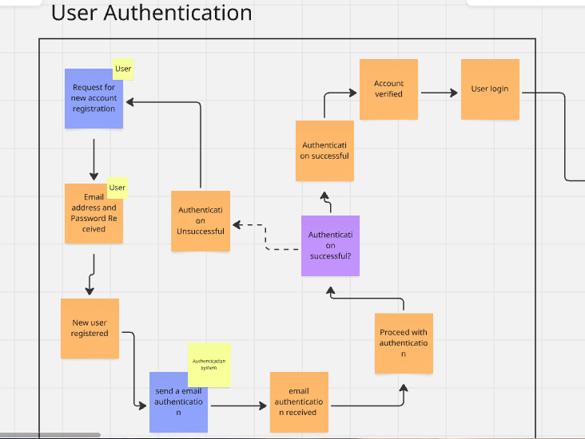
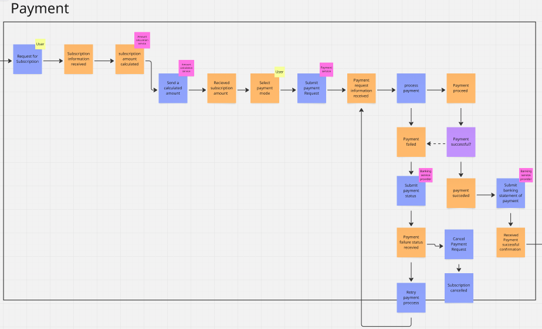
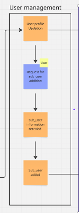
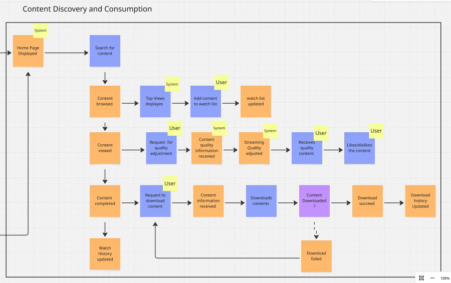

# NETFLIX EVENT STORMING CONCEPTUAL EXERCISE

## Introduction

This Event Storming workshop focused on mapping the Netflix streaming platform by identifying domain evnts, commands, actors, and the system components. Through collaborative modelling, we explored four critical areas: User Authentication, Payment Processing,User Management, and Content Discovery and Consumption. By visualizing these processes, we gained valuable insights into how different parts of the platform interact, helping to refine our understanding of the system's structures and workflows. This report summarizes the key findings insights and visual models developed during the session.

## Our Approach to Event Storming

We first researched event storming methodology and its application to complex domains. We then:

1. Identified key domain events for a Netflix platform
2. Organized these events into logical sequences and flows
3. Distinguished between user actions and system responses
4. Created visual diagrams using color-coding to represent different elements:
   - Orange sticky notes for events
   - Blue sticky notes for user commands or actions
   - Purple sticky notes for special processes
   - Yellow for the actors.

## Visual Process Models We Created

### 1. User Authentication Process

The User Authentication diagram shows the complete user registration and login flow, including:

- Initial account registration request (blue) by the User (yellow)
- Email verification process with separate success/failure paths
- Authentication decision points with appropriate redirects
- Account verification and successful login states

The color-coding identifies user-initiated actions against the system processes, and the flow shows both the happy path and exception handling for failed authentication attempts.

### 2. Payment Processing Flow

The Payment Processing diagram maps the complex payment handling system, showing:

- Multiple payment initiation points
- Validation and verification steps
- Success and failure paths with proper markings
- Integration with external payment processors
- Receipt generation and confirmation processes

This model identifies several critical decision points and demonstrates how the system handles various payment scenarios and edge cases.

### 3. User Management System

The User Management diagram focuses on profile management and the creation of sub-user profiles:

- User profile update process
- Sub-user (profile) creation flow
- Information collection and validation
- Profile activation and configuration

This streamlined flow shows how a single Netflix account can manage multiple user profiles while maintaining appropriate separation of preferences and viewing history.

### 4. Content Discovery and Consumption

The Content Discovery and Consumption diagram illustrates the core user experience, including:

- Home page content generation and display
- Search functionality and results presentation
- Content browsing by category or recommendation
- Watchlist management
- Playback controls and quality selection
- Download functionality for offline viewing
- Watch history tracking and updates

The diagram clearly shows the interaction between user activity and system responses, with appropriate tracking of state changes throughout the content consumption lifecycle.

## Key Learnings

Through this event storming exercise, we were able to learn the following:

1. **Domain Complexity**:  The Netflix domain has multiple processes that are interdependent and must work together seamlessly.

2. **Bounded Contexts**: We identified four natural bounded contexts that could potentially be developed as separate services or modules:
   - User Authentication & Account Management
   - Payment Processing
   - Profile/User Management
   - Content Discovery & Playback

3. **Event-Driven Architecture**: We recognized how an event-driven architecture could enable communication between these bounded contexts.

4. **User Experience Flows**: Mapping these processes helped us understand the entire user journey through the system.

## Conclusion

This event storming exercise provided valuable hands-on experience with a technique used in real-world software development. From describing the Netflix domain in terms of its events, we gained deeper understanding of complex system design and the practical application of domain-driven design concepts.

## Interactive Event Storming Board

This interactive board contains all four process diagrams:

[Netflix Event Storming Interactive Board](https://miro.com/app/board/uXjVIODFmDo=/)

